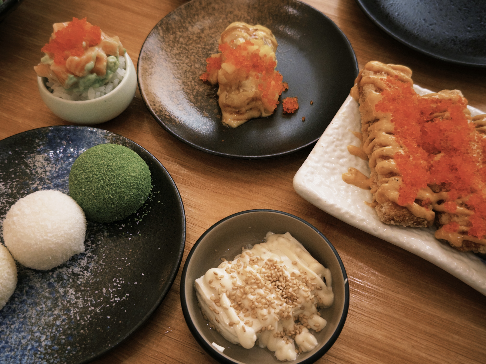
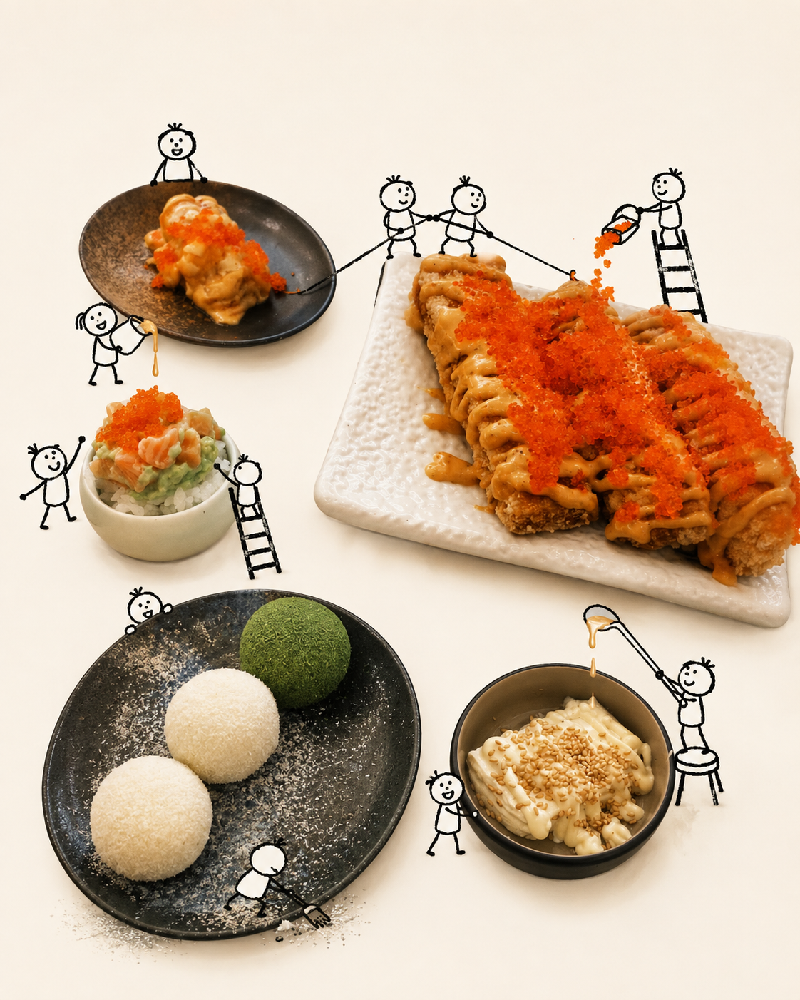
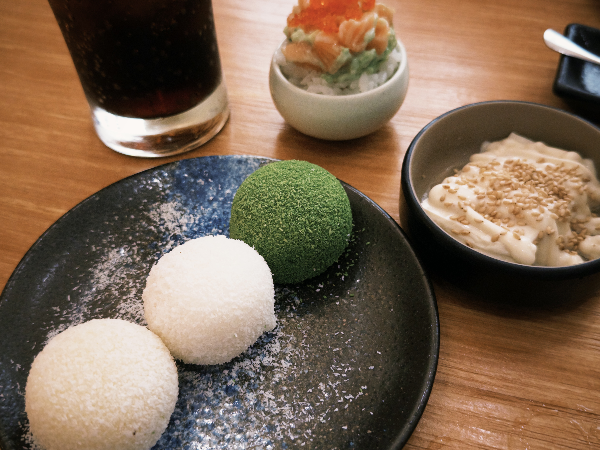
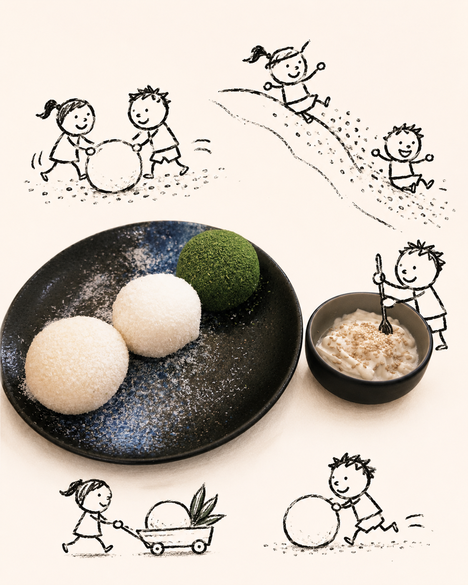

# 真实食物 × 儿童简笔画 竖版海报

## 初心

保留随手拍里最真实的食物质感，再给照片加一点天马行空的故事。于是让一群歪歪扭扭的小人跑进画面：有人搬食材、有人爬梯子、有人撒配料，也有人偷偷尝一口。真实摄影和儿童简笔画碰在一起，让普通生活照也能变成一张有趣的小海报。

> 这套玩法不只限于食物，以后还会继续延伸到咖啡、甜品、旅行和日常物件——把每一张随手拍，都变成一个小剧场。

这是一个图像生成 Skill：上传一张真实食物随拍，生成“真实食物 + 儿童简笔画小人”的竖版海报。核心是**保留照片里真实食物的质感**，再让一群歪歪扭扭的小人跑进来讲故事，而不是把整张照片卡通化。

## 效果

原始随拍 → 生成海报：

<table>
  <tr>
    <th>原始随拍 1</th><th>效果 1</th><th>原始随拍 2</th><th>效果 2</th>
  </tr>
  <tr>
    <td></td>
    <td></td>
    <td></td>
    <td></td>
  </tr>
</table>

（素材在 `examples/` 目录：原始随拍 + 生成效果，一一对应。）

## 这个 Skill 做什么

给一张真实食物（或咖啡/甜品/日常物件）随拍做一张竖版海报：

- 保留照片里真实食物的摄影质感、食材纹理、光泽、酱汁、芝麻、鱼籽、抹茶粉、椰蓉、木质托盘、陶瓷器皿。不把食物重新画成插画。
- 清理复杂背景，换成大面积温暖的象牙白 / 奶油白留白。
- 让一群**歪歪扭扭的儿童简笔画小人**跑进画面，像小小工人一样跟巨大食物互动：搬、爬、撒、淋、扫、拉、推、挥旗、偷偷尝一口。
- 默认给两套：
  - `带字版`：顶部加粗黑、歪歪扭扭、儿童手写感中文标题。
  - `无字版`：完全不出现文字，靠小人动作讲故事。

## 原创 Prompt

完整原始创意方向见：

- [`references/prompt-zh.md`](references/prompt-zh.md) （中文，原创需求全文）
- [`references/prompt-en.md`](references/prompt-en.md) （英文版，可直接作为图像模型输入）

## 怎么用

把本仓库作为 Skill 放到支持 Skill 的 agent 环境里，或把 `references/prompt-zh.md` 的中文方向 + 原始食物照片一起交给图像生成模型。

典型用法：

```text
上传这张真实食物照片，按这个风格做一张竖版海报，带字版和无字版都出。
```

## 目录结构

```text
.
├── README.md                 本说明
├── SKILL.md                  Skill 定义
├── references/
│   ├── prompt-zh.md          原创中文 prompt
│   └── prompt-en.md          英文 prompt（图像模型可读）
└── examples/
    ├── origin1.jpg           原始随拍 1
    ├── change1.png           效果 1
    ├── origin2.jpg           原始随拍 2
    └── change2.png           效果 2
```

这是个人原创的创意玩法：保留真实随手拍，再加一点天马行空的小人故事。
